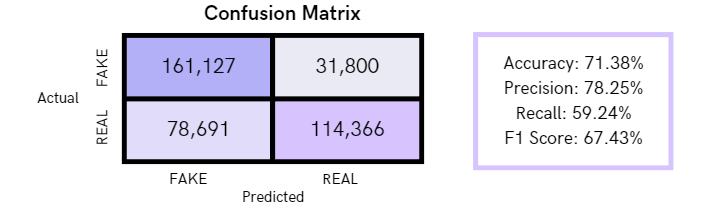
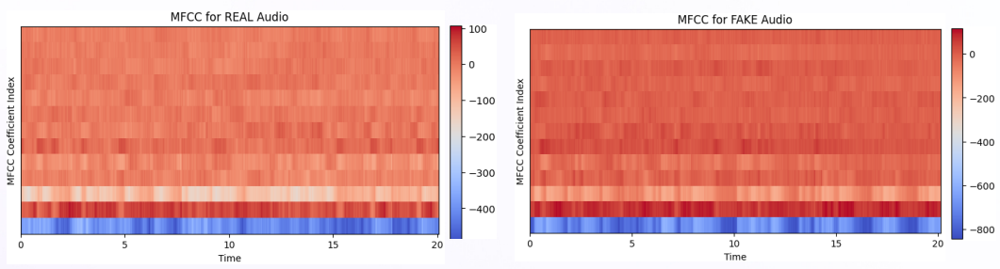
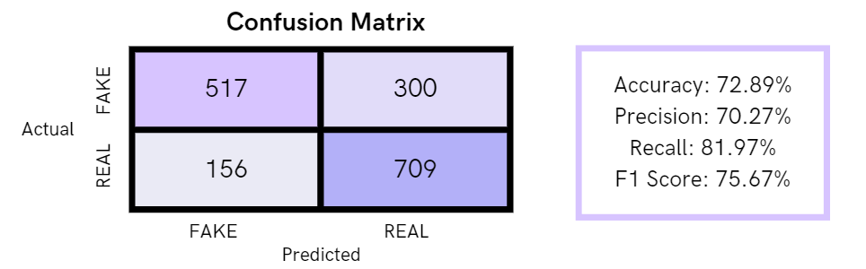

# Can Detect Or Not Ah?
Application Link: https://can-detect-or-not-ah.netlify.app/video

## Introduction
In the ever-evolving landscape of artificial intelligence (AI), the rise of sophisticated technology has brought with it a double-edged sword. While AI has unlocked unprecedented possibilities and efficiencies across various sectors, it has also given rise to the proliferation of deepfake technology. Deepfakes, a portmanteau of "deep learning" and "fake," represent a formidable manifestation of AI's potential, one that poses a significant problem to society. [1]

IAI is now capable of convincingly replicating human behaviors, voices, and even appearances, paving the way for the creation of deepfake content—artificially generated media, including videos, audio recordings, and images, that seamlessly mimic real-life counterparts. 

The implications of this technology have far-reaching consequences for society at large. From 2022 to Q1 2023, the proportion of deepfakes among all fraud types increased by 4,500% in Canada, by 1,200% in the U.S., by 407% in Germany, and by 392% in the UK. [2]

This reflects the urgent need for reliable detection of synthetic or manipulated images,  which brings us to our problem statement.

Team Members: Calvin Septyanto, Chen Jia Wei, Seah Ding Xuan

## Problem Statement
Our project is a multifaceted initiative aimed at countering the burgeoning threat of deepfake technology across diverse media formats. Our approach leverages a rich, multi-source dataset comprising artificial (fake) and factual (real) images, audio, and video. This project is dedicated to developing advanced detection algorithms capable of identifying manipulated content, regardless of its origin.

## Project Scope
Data Collection and Preprocessing:
<li> Gather a wide variety of deepfake and genuine content, including images, audio, and video, from diverse sources. </li>
<li>Preprocess data to ensure consistency, quality, and compatibility </li>  

Model Selection and Development:
<li>Develop and fine-tune CNN models optimized for image-based deepfake detection.</li>
<li>Explore the use of other neural network architectures, such as Recurrent Neural Networks (RNNs) for audio and video content analysis.</li> 

Training and Validation:
<li>Train the selected neural network models on the multi-source dataset, utilizing a portion for training and a separate portion for testing.</li> 
<li>Optimize model hyperparameters to maximize classification accuracy.</li>
<li>Implement cross-validation techniques to ensure robustness and prevent overfitting.</li> 

Evaluation Metrics:
<li>Define appropriate evaluation metrics, such as accuracy, precision, recall, F1-score, and area under the ROC curve (AUC), for assessing model performance.</li> 

Use Cases and Applications:
<li>Implement deepfake classification tools in a web application </li> 

Documentation and Reporting:
<li>Maintain clear and organized documentation of data sources, preprocessing steps, model architectures, and results.</li>
<li>Summarize findings, challenges, and outcomes</li> 

## Solutions & Results
### Image Detection

Convolutional Neural Networks (CNNs) can be a valuable tool for detecting and predicting deepfakes, which are manipulated or generated videos or images created using artificial intelligence techniques, particularly deep learning models. On the extreme ends, using deepfakes can propagate misinformation,  undermine the authenticity of the media and even be misused to escalate political situations. [3] Therefore, our team explored designing a custom CNN architecture and fine-tuned it in an attempt to predict both real images and fake images from a variety of generators. The data comprises 1,531,749 real images and 964,989 fake images with diverse categories including: human faces, animals, places, vehicles and real-life objects [5]. CNN models can potentially learn the different generative methods from the diverse deepfake dataset  (including 13GANs, 7 Diffusion, and 5 miscellaneous generators) that we are training on [4], allowing us to separate real images from generated ones, especially those in these 25 particular generators. The results of the CNN on the test data is as shown below:

  

### Audio Detection

One other aspect of important deepfake detection is via the generated audio, which will be subsequently used in our video detector. Our approach to deepfake audio detection will be via Mel-frequency cepstral coefficients (MFCCs) analysis, a common approach to speech processing. MFCCs provide a short-term power spectrum of an audio signal obtained through a series of signal processing steps, including: Framing, Windowing, Fast Fourier Transform, Mel Filterbank and Discrete Cosine Transform, etc [6]. The resulting MFCC coefficients represent the spectral content of the audio signal in a compact form, which captures important characteristics of speech such as phonetic information. Here are the sample output results for MFCC analysis of a real vs fake audio.

  

### Video Detection

Regarding video detection of deepfakes, we will employ a mix of the two models that we have trained previously. Firstly, we will preprocess the uploaded video, extracting the audio and a random set of frames. The audio will be fed into the audio detection model we have used to identify modified audio. All the extracted frames will be fed into the CNN, and an aggregated score is obtained from the frames and subsequently classified accordingly. If either of the videos or audios detects deepfake, it will inform the user accordingly.

  

## User Requirements
### Functional Requirements
**Image Detector**: Users should be able to upload their images onto the web application, which will process the image and return a result stating whether it is ‘AI generated’ or ‘Human Generated’. There will also be a set of sample images on the side of the application, which users can click on to test out the image detector.

**Video Detector**: Users should be able to upload videos onto the web application, which will extract the audio and a random set of frames to be used for deepfake detection. It will return a result stating ‘AI generated’ if either the audio or extracted images is detected to be a deepfake. There will also be a set of sample videos on the side of the application, which users can click on to test out the video detector.

### Non-Functional Requirements
**Performance:** Simple detections, such as image and audio detection, should be processed within 6 seconds. Complex detection, such as video detection, should be processed within 20 seconds.

**Reliability:** Our web application should be able to handle common HTTP protocol errors (e.g. Handle error 400 if users submit invalid pictures or videos by providing input validation).

**Usability:** Intuitive application with simple and elegant design. 

**Accuracy:** For both detection of deepfake images and audio, we aim to have an accuracy of above 70% for any images, videos and audio generated by generators we have trained on.

**Availability:** Our application should be available 95% of the month.
 

## Application Development
### Tech Stack
**React**: Front-End Framework

**Flask**: Back-End Framework

### REST API
**POST /upload**: Load images to our CNN image detection model, and return the prediction.

**POST /upload_audio**: Extract audio from the video submitted by users, load audio through MFCCs to our audio detection model, and return the prediction.

**POST/upload_video**: 1) Extract 250 random frames from the video; 2) Load all the 250 frames to our CNN image detection model, and amongst the 250 random frames, we see whether AI or Human group is more dominant; 3) Extract audio from the video, load audio through MFCCs to our detection model; 4) If either the image detection or video detection labels the video as AI, then we return AI as our prediction; otherwise, return Human Generated.

## Further Improvements
**Transfer Learning**: Make use of pre-trained models which have been trained on massive datasets. They can then be fine-tuned with our deepfake detection task for better accuracy.

**Ensemble Methods**: Combine predictions from diverse model architectures to capture various patterns in AI-generated content.

**Hardware Scaling**: Utilize cloud services or renting GPU time for more extensive computations

**Cross-modal models**: Investigate neural network models capable of processing multiple data types (text, image, audio, and video) for enhanced classification accuracy.

**Model Evaluation**: Employ cross-modal evaluation metrics to gauge the effectiveness of multi-source deepfake classification. Currently, we are only using accuracy as a metric for training.

## References

[1] Seow, J. W., Lim, M. K., Phan, R. C. W., & Liu, J. K. (2022). A comprehensive overview of Deepfake: Generation, detection, datasets, and opportunities. Neurocomputing, 513, 351–371. https://doi.org/10.1016/j.neucom.2022.09.135

[2] Deepfakes are the new big threat to business. How can we stop them? | The Sumsuber. (n.d.). Sumsub. , from https://sumsub.com/blog/liveness-and-deepfake-detection/

[3] Westerlund, M. (n.d.). The Emergence of Deepfake Technology: A Review. Technology Innovation Management Review, 9(11). https://timreview.ca/sites/default/files/article_PDF/TIMReview_November2019%20-%20D%20-%20Final.pdf

[5] Juefei-Xu, F., Wang, R., Huang, Y., Guo, Q., Ma, L., & Liu, Y. (2022). Countering malicious deepfakes: Survey, battleground, and horizon. International Journal of Computer Vision, 130(7), 1678–1734. https://doi.org/10.1007/s11263-022-01606-8

[6] Tiwari, V. (n.d.). MFCC and its applications in speaker recognition. International Journal on Emerging Technologies, 1(1), 19–22. https://citeseerx.ist.psu.edu/document?repid=rep1&type=pdf&doi=b4e9c14c67b8aa431a40041cce0a3564144e1a2a

[8] S, L., & Sooda, K. (2022). Deepfake detection through key video frame extraction using gan. 2022 International Conference on Automation, Computing and Renewable Systems (ICACRS), 859–863. https://doi.org/10.1109/ICACRS55517.2022.10029095

Datasets used:

[4] Dataset retrieved from https://www.kaggle.com/datasets/awsaf49/artifact-dataset

[7] Dataset retrieved from https://www.kaggle.com/code/phoenix9032/fake-audio-detector/notebook

